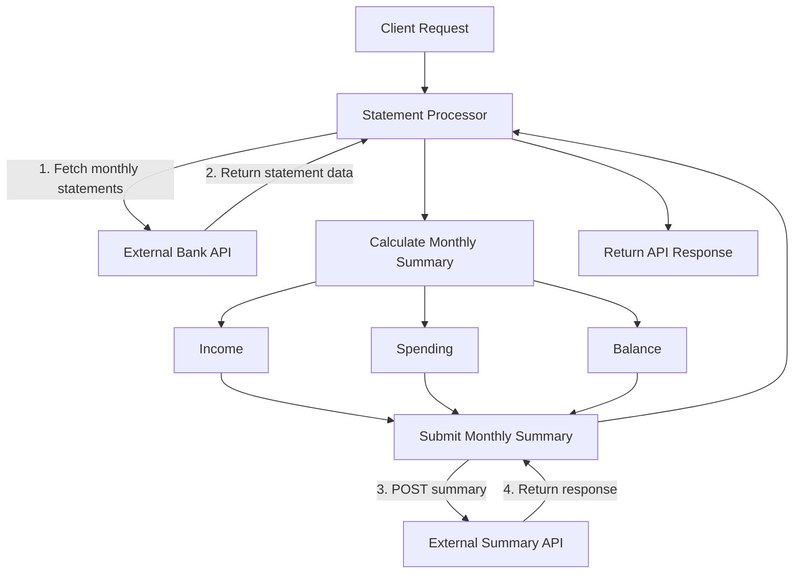

# Bank Statement Processor

A Spring Boot application that retrieves monthly bank statement data from an external banking API, calculates account totals, and submits the resulting summary to an external API.

###  What problem does this application try to solve?

The application automates monthly bank statement processing by fetching statement data from an external API, calculating income, spending, and balance, and submitting the summary to another API without requiring persistence.

It follows Contract-First Development and Ports & Adapters (Hexagonal) Architecture to enable independent development and separate business logic from external integrations.

---

## Business Goal

The objective of this application is to process monthly bank statement data obtained from an external banking service.

For a given account and month, the application:

1. Retrieves all statement transactions from the external Bank API.
2. Aggregates transactions for the requested month.
3. Calculates:
  - Total income
  - Total spending
  - Monthly balance
4. Sends the calculated monthly summary to an external Summary API.
5. Returns the processing result to the caller.

The application does **not** maintain a persistence layer or store transaction data. All processing is performed in memory using data retrieved from external services.

### Processing Flow



---

## Overview

The application acts as an orchestration layer between external systems.

Consumers initiate processing for a specific account and month. The application retrieves all required statement data, performs the necessary calculations, and submits the resulting summary to a downstream service.

Technical details of external integrations such as pagination, HTTP communication, serialization, and vendor-specific API contracts are hidden from application consumers.

---

## Contract-First Development

The integrations with the external APIs are developed using a contract-first approach, enabling development to begin before the other parties have
completed their implementations by using agreed API contracts and generated clients.

An OpenAPI specification acts as the source of truth for the external API contract. Java client code is generated automatically during the Maven build process.

### Generation Flow

```text
bank-statement-api.yaml
          │
          │ OpenAPI Generator
          ▼
┌──────────────────────────────────────────┐
│ Generated Bank HTTP Client               │
│                                          │
│ client.bank.api                          │
│   └── StatementsApi.java                 │
│                                          │
│ client.bank.model                        │
│   ├── MonthlyStatement.java              │
│   ├── Transaction.java                   │
│   └── Problem.java                       │
│                                          │
│ client.bank.invoker                      │
│   └── ApiClient.java                     │
└──────────────────────────────────────────┘
          │
          ▼
      Bank API
```

### Generated Client Configuration

During the `generate-sources` Maven phase:

- The OpenAPI specification (`bank-statement-api.yaml`) is processed by OpenAPI Generator.
- A Java HTTP client is generated using Spring's `RestClient`.
- Generated sources are written to:

```text
target/generated-sources/bank-statement
```

Generated code is organized into:

```text
client.bank.api
client.bank.model
client.bank.invoker
```

The generated client uses:

- Jakarta APIs
- Jackson for JSON serialization/deserialization

### Generate the Client

```bash
./mvnw generate-sources
```

---

## Application API

The application exposes an endpoint that triggers the monthly statement processing workflow.

### Request Monthly Summary Processing

```http
POST /api/v1/accounts/{accountId}/monthly-summary/{month}
```

#### Example

```http
POST /api/v1/accounts/account-12345/monthly-summary/2026-10
```

### Design Considerations

#### Request Validation

- Request validation is implemented as a design consideration to ensure incoming requests meet the expected requirements before processing.

- Input Validation: Validates request fields, formats, and required values.

- Data Integrity: Prevents invalid or incomplete data from entering the processing flow.

- Error Handling: Returns appropriate HTTP responses for invalid requests.

-  Reliability: Reduces unnecessary processing and helps maintain consistent application behavior.


#### Request Pagination

The external banking API exposes paginated statement data.

This implementation deliberately hides pagination from application consumers. The application is responsible for retrieving all pages required for the requested month, aggregating the results, performing the calculations, and submitting the final summary.


#### Observability

Implemented request correlation and logging to improve traceability and troubleshooting.

-  Generates a UUID when the incoming **X-Request-ID** header is missing; otherwise, reuses the provided ID.

- Returns the request ID in the response header and stores it in MDC for log correlation.

- Propagates X-Request-ID to downstream APIs via generated OpenAPI clients.

- Logs key processing events, transaction counts, summary calculation, and downstream submission status.

This enables easier request tracking across service boundaries and simplifies debugging.

#### Rate Limiting

Rate limiting is implemented to protect the application from excessive requests and maintain stability under heavy load.

- Resource Protection: Limits incoming requests to prevent excessive memory and CPU consumption.

- Application Stability: Reduces the risk of resource exhaustion because monthly summary processing is performed in application memory.

- Controlled Processing: Restricts the number of requests allowed within a configured time period using Resilience4j.

- HTTP 429 Response: Returns 429 Too Many Requests when the configured rate limit is exceeded.

- Improved Reliability: Helps maintain consistent performance and reliable processing during traffic spikes.


---

## Architecture

### Ports & Adapters (Hexagonal Architecture)

The application is implemented using **Ports & Adapters Architecture**.

The business logic resides at the center of the application and communicates with external systems exclusively through well-defined ports.

```text
                ┌────────────────────┐
                │   REST Controller  │
                └─────────┬──────────┘
                          │
                    Inbound Port
                          │
                          ▼
                ┌────────────────────┐
                │  Application Core  │
                │   Business Logic   │
                └────────────────────┘
                          ▲
                          │
                   Outbound Port
                          │
         ┌────────────────┴────────────────┐
         │                                 │
         ▼                                 ▼
  Bank API Adapter              Summary API Adapter
```

### Benefits

- Clear separation of concerns
- Business logic independent of frameworks and infrastructure
- Easier unit and integration testing
- Reduced coupling to external systems
- Easier replacement of adapters and technologies
- Improved maintainability and extensibility

---

## Working Without a Real API

A real banking API may not be available during early development.

To avoid blocking progress:

- API contracts are defined first using OpenAPI.
- HTTP clients are generated from the contracts.
- Adapters can be implemented against mocks, stubs, or WireMock servers.
- Business logic can be developed and tested independently of external providers.

This enables parallel development while maintaining a stable integration contract.

---

## Testing

The project includes unit tests, Spring Boot slice tests, and integration tests to verify business logic, individual application layers, and end-to-end component interactions.

To performs a clean build, runs tests, and verifies the project through Maven's build lifecycle

 ```bash
./mvnw clean verify
 ```


### Unit Tests

MonthlySummaryCalculatorTest  & ProcessMonthlyStatementUseCaseTest verifies

- Monthly balance calculations
- Income aggregation
- Spending aggregation
- Application services

### Slice Tests

MonthlySummaryControllerTest is a Spring MVC slice test (@WebMvcTest) that verifies 

- controller mappings
- request validation
- response serialization
- exception handling 

while mocking the application use case layer. It is not a full integration test because the business logic and external dependencies are mocked.

### Integration Tests

BankStatementApiAdapterIntegrationTest & MonthlySummaryApiAdapterIntegrationTest verifies

- REST API endpoints
- External API adapters
- OpenAPI-generated client integration

### Contract Tests

Contract tests have not been included in the current implementation phase. They may be introduced in a future phase to verify API compatibility between services and ensure that changes to API contracts do not unintentionally break integrations.

Benefits of contract tests:

- Detects API contract mismatches between consumers and providers.

- Reduces integration issues when services evolve independently.

- Improves confidence in API changes without relying solely on end-to-end testing.

- Supports safer and more reliable service integration.

---

## Dockerization and Deployment

The Spring Boot application can be packaged and deployed as a containerized Spring Boot service. Environment-specific settings are supplied through environment variables.

### Configuration

Configure the external API URLs in `.env`:

```dotenv
BANK_API_BASE_URL=http://host.docker.internal:3000
MONTHLY_SUMMARY_API_BASE_URL=http://host.docker.internal:3001
APP_ENV=local
```

Use `host.docker.internal` when the bank statement and summary APIs run directly on your host machine for local testing. Otherwise, update the URLs and ports for your environment.

### Build and Run

Package the application and build the Docker image:

```bash
./mvnw clean package
docker compose up --build -d
```

### Test and Monitor

Check application health and logs:

```bash
curl http://localhost:8080/actuator/health
docker compose logs -f statement-processor
```

Stop the application:

```bash
docker compose down
```


### Remote Server Deployment

1. Package the application and build the Docker image.
2. Push the image to a container registry (e.g., Docker Hub or a private registry).
3. Install Docker and Docker Compose on the remote server.
4. Pull the image and configure environment variables, including `BANK_API_BASE_URL` and `MONTHLY_SUMMARY_API_BASE_URL`, for the remote environment.
5. Start the application using Docker Compose:

   ```bash
   docker compose up -d
   ```

6. Verify deployment using application health endpoints and container logs.

**Note:** Ensure the server can reach both external APIs, configure firewall rules and HTTPS as appropriate, and store credentials securely. Do not use `host.docker.internal` for APIs hosted on another remote server; use their actual reachable hostname or IP address.

Typical deployment options include:

- Docker
- Kubernetes
- Azure Kubernetes Service (AKS)
- Amazon EKS
- Google Kubernetes Engine (GKE)

---

## Persistence

No persistence layer is used in this solution.

The application does not store transactions, statements, or summaries in a database. Data is retrieved from external services, processed in memory, and forwarded to the target API.